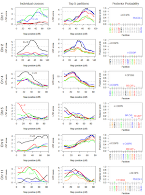
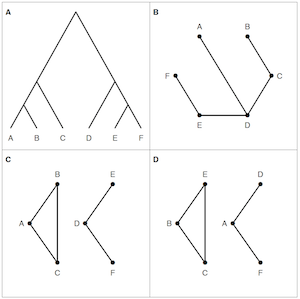
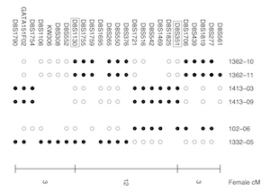
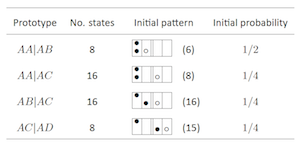

  

      <ul class="nav">
          <li><a href="{{ BASE_PATH }}/assets/broman.pdf">cv</a></li>
          <li><a href="https://github.com/kbroman">github</a></li>
          <li><a href="http://kbroman.wordpress.com">blog</a></li>
          <li><a href="https://twitter.com/kwbroman">@kwbroman</a></li>
      </ul>
  

|                   |                    |
| :---------------- | -----------------: |
|          |      |
|                   |                    |
|                 |            |
|                   |                    |
|        |  |
|                   |                    |
|        |  |
|                   |                    |
|                |       |
|                   |                    |
|  | |
|                   |                    |
{:.widetable}

  

      <ul class="nav">
          <li><a href="index.html">back</a></li>
      </ul>
  

