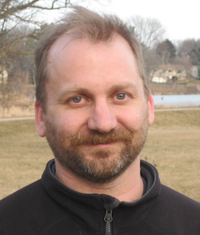

Karl Broman is Professor in the
[Department of Biostatistics &amp; Medical Informatics](https://www.biostat.wisc.edu)
at the University of Wisconsin&ndash;Madison;
research in statistical genetics; developer of
[R/qtl](https://rqtl.org) (for [R](https://www.r-project.org)).

Karl received a BS in [mathematics](http://uwm.edu/math)
in 1991, from the
University of Wisconsin&ndash;Milwaukee, and a
PhD in [statistics](http://stat.berkeley.edu) in 1997, from the
University of California, Berkeley; his PhD advisor was
[Terry Speed](http://www.wehi.edu.au/people/terry-speed).
He was a postdoctoral fellow with James Weber at the
[Marshfield Clinic Research Foundation](http://research.marshfieldclinic.org),
1997&ndash;1999. He
was a faculty member in the [Department of Biostatistics](https://www.jhsph.edu/departments/biostatistics/) at Johns
Hopkins University, 1999&ndash;2007. In 2007, he moved to the
[University of Wisconsin&ndash;Madison](https://www.wisc.edu).

Karl is a Senior Editor for [_Genetics_](http://www.genetics.org) and
a member of the [_BMC Biology_](https://bmcbiol.biomedcentral.com)
[Editorial Board](https://bmcbiol.biomedcentral.com/about/editorial-board).

Karl is an applied statistician focusing on problems in genetics and
genomics &ndash; particularly the analysis of meiotic recombination and the
genetic dissection of complex traits in experimental organisms. The
latter is often called &ldquo;QTL mapping.&rdquo; A QTL is a
_quantitative trait locus_ &ndash; a genetic locus that influences a
quantitative trait. He is enthusiastic about the value
of interactive data visualizations for exploring high-dimensional genetic data;
see his [R/qtlcharts package](https://kbroman.org/qtlcharts) and
his [D3 examples](https://www.biostat.wisc.edu/~kbroman/D3).

[curriculum vitae ]({{ BASE_PATH }}/assets/broman_cv.pdf) 
[orcid](https://orcid.org): [0000-0002-4914-6671](https://orcid.org/0000-0002-4914-6671) 
[google scholar](https://scholar.google.com/citations?sortby=pubdate&hl=en&user=42tCp5UAAAAJ&view_op=list_works) 
[pubmed](https://www.ncbi.nlm.nih.gov/pubmed/?term=broman+kw) 
<!-- [impactstory](https://impactstory.org/u/0000-0002-4914-6671)  -->
[github](https://github.com/kbroman) 
[blog](https://kbroman.org/blog)  
he/him

---

<h4>contact</h4>

    

        

            Karl Broman 
            <a href="https://www.biostat.wisc.edu">Department of Biostatistics &amp; Medical Informatics</a> 
            <a href="https://www.wisc.edu">University of Wisconsin&ndash;Madison</a> 
            <a href="https://map.wisc.edu/s/2tie3nen">2126 Genetics/Biotechnology Center</a> 
            425 Henry Mall 
            Madison, Wisconsin 53706 
            USA  

            

            Email: <code>bro</code><b>I</b><code>man</code><b>don't</b><code>@</code><b>want</b><code></code><b>spam!
            </b><code></code><b>So</b><code></code><b>please</b><code>wi</code><b>leave
            </b><code>sc</code><b>me</b><code>.</code><b>alone</b><code>e</code><b>!</b><code>du</code> 
            Phone: 608-262-4633
            

        

        

        
        

    

