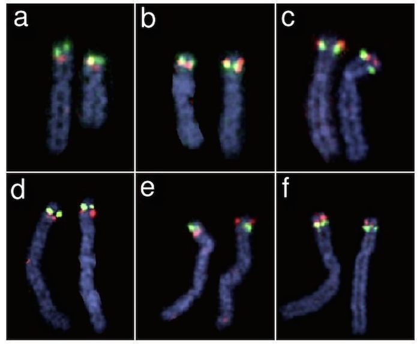

  

      <ul class="nav">
          <li><a href="preCCprob_tabS13.html">prev</a></li>
          <li><a href="interfer_fig1.html">next</a></li>
      </ul>
  

Broman KW, Matsumoto N, Giglio S, Martin CL, Roseberry JA, Zuffardi O,
Ledbetter DH, Weber JL (2003) Common long human inversion polymorphism
on chromosome 8p.  In: Goldstein DR (ed)
[Science and Statistics: A Festschrift for Terry Speed](http://www.imstat.org/publications/lecnotes.htm).
IMS Lecture Notes-Monograph Series, Vol 40, pp 237-245

**Figure 2**. &mdash; Metaphase FISH results from CEPH family individuals
(lymphoblastoid cell lines) and other individuals (peripheral blood
lymphocytes). Probes were DNA from BAC 173O4 (encompassing D8S351)
labeled with Spectrum Green and BAC 257O3 (encompassing D8S1130)
labeled with Spectrum Orange. a) CEPH individual 102-01, homozygous
for the order shown in Figure 1. b) CEPH individual 1331-02,
heterozygous for the inversion.  c) CEPH individual 1362-02,
homozygous for the inverted order. d) e) f) Individuals homozygous
for the Figure 1 order, heterozygous, and homozygous for the
inverted order, respectively.
