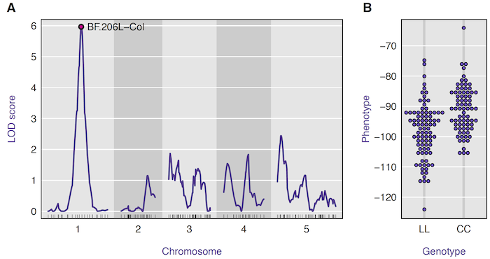

  

      <ul class="nav">
          <li><a href="rqtlbook.html">prev</a></li>
          <li><a href="rqtlexper_fig2.html">next</a></li>
      </ul>
  

Broman KW (2014) Fourteen years of R/qtl: Just
barely sustainable. J Open Res Softw
2(1):e11

**Figure 1**. &mdash; Typical analysis results from R/qtl. A: LOD curves across
the genome, measuring association between phenotype and genotype,
and B: Association between genotype and phenotype at the
marker with the strongest association. The data are from Moore et
al. (2013); panel B was created using the R package beeswarm.
