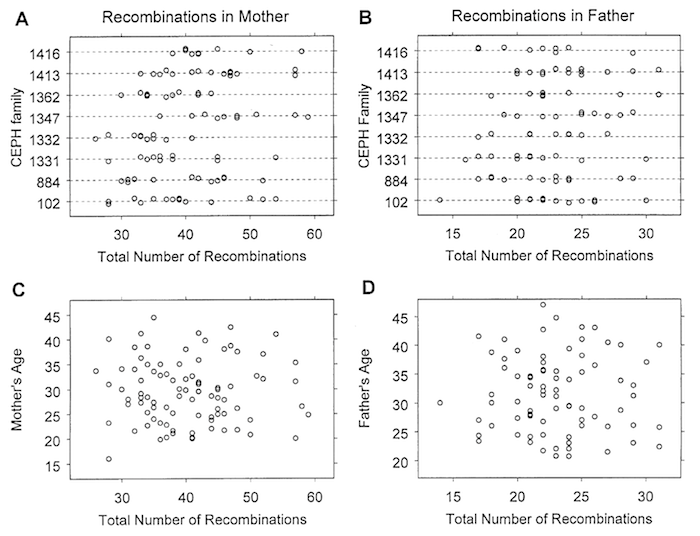

Broman KW, et al. (1998) Comprehensive human genetic maps: Individual
and sex-specific variation in recombination. Am J Hum Genet 63:861-869
\[[PubMed](http://www.ncbi.nlm.nih.gov/pubmed/9718341) |
[pdf (534k)](http://www.biostat.wisc.edu/~kbroman/publications/geneticmaps.pdf)\]

**Figure 3**. &mdash; Total no. of observed recombination events in the 22
autosomes in each male and female meiosis, plotted by family (A and
B) and against the age of the parent at the birth of the
corresponding child (C and D).
