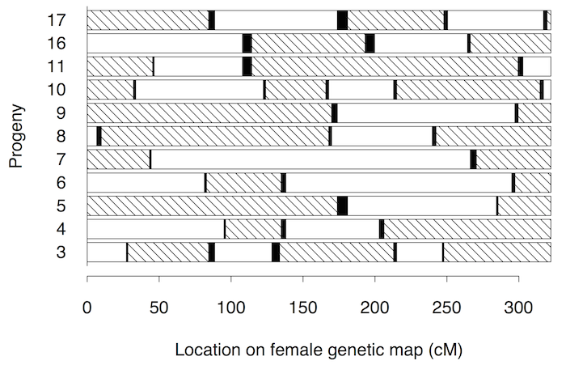

Broman KW, Weber JL (2000) Characterization of human crossover
interference. Am J Hum Genet 66:1911-1926
\[[PubMed](http://www.ncbi.nlm.nih.gov/pubmed/10801387)
| [pdf (291k)](http://www.biostat.wisc.edu/~kbroman/publications/interfer.pdf)\]

**Figure 1**. &mdash; Grandparental phase in the maternal chromosomes 2, for
the 11 progeny from family 1331. Hatched segments denote
grandpaternal origin; unblackened segments, grandmaternal
origin. The smaller blackened segments are the noninformative
segments in which a recombination occurred.
