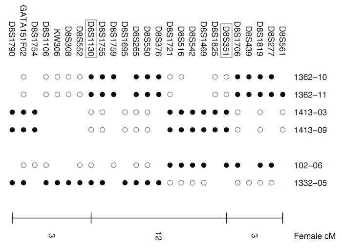

Broman KW, et al. (2003)
Common long human inversion polymorphism on chromosome 8p.  In:
Goldstein DR (ed) [Science and Statistics: A Festschrift for Terry
Speed](http://www.imstat.org/publications/lecnotes.htm).  IMS Lecture Notes-Monograph Series, Vol 40, pp 237-245
\[[Abstract](http://www.biostat.wisc.edu/~kbroman/publications/inver_abstract.html) | [pdf (139k)](http://www.biostat.wisc.edu/~kbroman/publications/inversion.pdf)\]

**Figure 1**. &mdash; Maternal haplotypes for a small portion of chromosome 8p
for six CEPH family children (identified by
family&ndash;individual). Filled symbols indicate alleles from the
maternal grandfather, open symbols alleles from the maternal
grandmother, and blank spaces indicate missing data (due mostly to
homozygous markers in the mother). The order of markers is telomeric
(left) to centromeric (right). BACs encompassing the two markers shown
in boxes were used in the FISH experiments.
