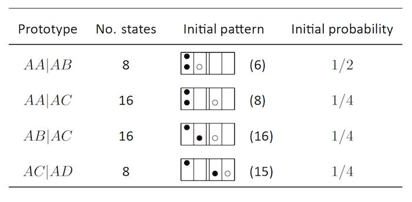

  

      <ul class="nav">
          <li><a href="phyloqtl_fig6.html">prev</a></li>
          <li><a href="rigenome_fig2.html">next</a></li>
      </ul>
  

Broman KW (2012)  Genotype probabilities at intermediate generations in the construction of recombinant inbred lines.  Genetics 190:403-412
\[[PubMed](http://www.ncbi.nlm.nih.gov/pubmed/22345609) | [pdf (1.1M)](http://www.biostat.wisc.edu/~kbroman/publications/preCCprob.pdf) | [source on github](http://www.github.com/kbroman/preCCProbPaper)\]

**Table S13**. &mdash; Starting states for the calculation of probabilities of
two-locus autosomal diplotypes of the form <em>AA</em>|<em>AB</em>, in
the generation of four-way RIL by sibling mating.
