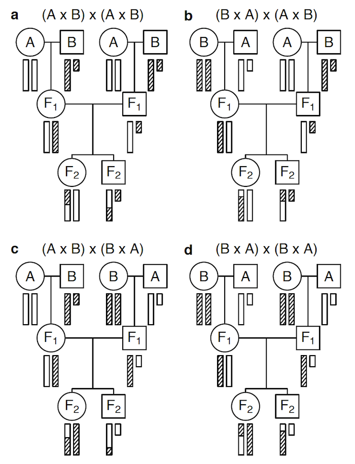

Broman KW, et al. (2006)  The X chromosome
in quantitative trait locus mapping.  Genetics 174:2151-2158
\[[PubMed](http://www.ncbi.nlm.nih.gov/pubmed/17028340) | [pdf (169k)](http://www.biostat.wisc.edu/~kbroman/publications/xchr.pdf)\]

**Figure 2**. &mdash; The behavior of the X chromosome in an intercross.
Circles and squares correspond to females and males, respectively.
Open and hatched bars correspond to DNA from
strains A and B, respectively. The small bar is the Y chromosome.
