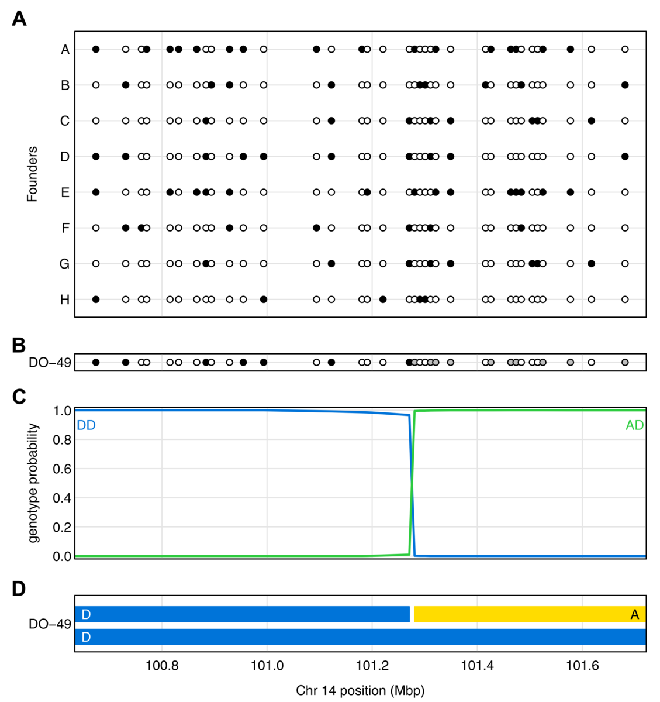

  

      <ul class="nav">
          <li><a href="mbmixups_fig3.html">prev</a></li>
          <li><a href="mbmixups_fig1.html">next</a></li>
      </ul>
  

Broman KW (2022) A generic hidden Markov model
for multi-parent populations. [G3
(Bethesda)](https://academic.oup.com/g3journal) 12:jkab396

**Figure 1**. &mdash; Illustration of genotype reconstruction in a 1
  Mbp region in a single Diversity Outbred (DO) mouse. **a**.
  Genotypes of eight founder strains at a set of SNPs, with open and
  closed circles corresponding to being homozygous for the
  more-frequent and less-frequent allele, respectively. **b**.
  Genotype of the DO mouse at the SNPs, with gray indicating the mouse
  is heterozygous. **c**. Genotype probabilities for the DO mouse
  along the chromosome segment, given the observed data. Genotypes
  other than the two shown have negligible probability across the
  region. **d**. Inferred haplotypes in the DO mouse.
