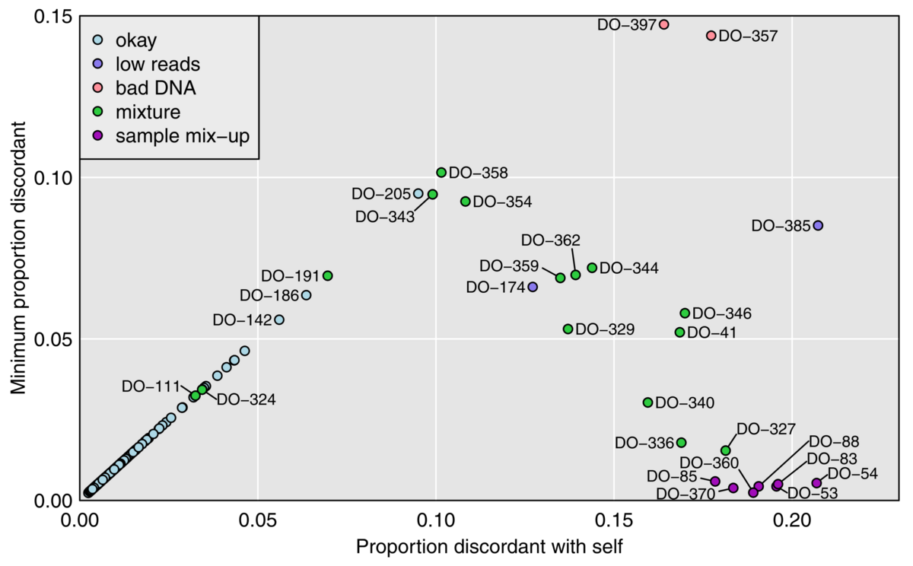

  

      <ul class="nav">
          <li><a href="genhmm_fig1.html">prev</a></li>
          <li><a href="iplotCorr.html">next</a></li>
      </ul>
  

Lobo AK, Traeger LL, Keller MP, Attie AD, Rey FE, Broman KW (2021)
Identification of sample mix-ups and mixtures in microbiome data in
Diversity Outbred mice. [G3
(Bethesda)](https://academic.oup.com/g3journal) 11:jkab308

**Figure 1**. &mdash; Plot of minimum distance vs. distance to self. Each point is a
microbiome sample and distances to genomic DNA samples are measured
by taking, among reads that overlapped a SNP where the genotyped
sample was homozygous, the proportion with an allele that was
discordant with the inferred SNP genotype. The microbiome samples
are categorized according to our conclusions about their
status.
