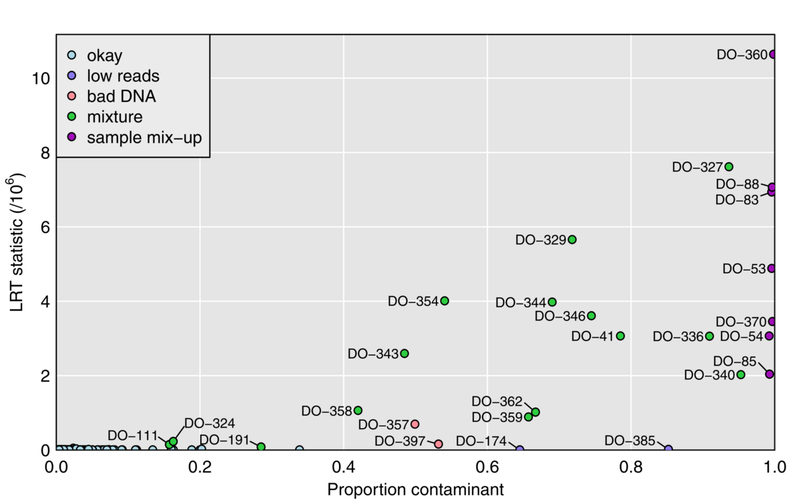

  

      <ul class="nav">
          <li><a href="samplemixups_fig7.html">prev</a></li>
          <li><a href="genhmm_fig1.html">next</a></li>
      </ul>
  

Lobo AK, Traeger LL, Keller MP, Attie AD, Rey FE, Broman KW (2021)
Identification of sample mix-ups and mixtures in microbiome data in
Diversity Outbred mice. [G3
(Bethesda)](https://academic.oup.com/g3journal) 11:jkab308

**Figure 3**. &mdash; Plot of maximum achieved likelihood ratio test statistic (for
  the test of no mixture) vs. the estimated proportion from a
  contaminant, for each microbiome sample. The samples are categorized
  by our conclusions about their status.
