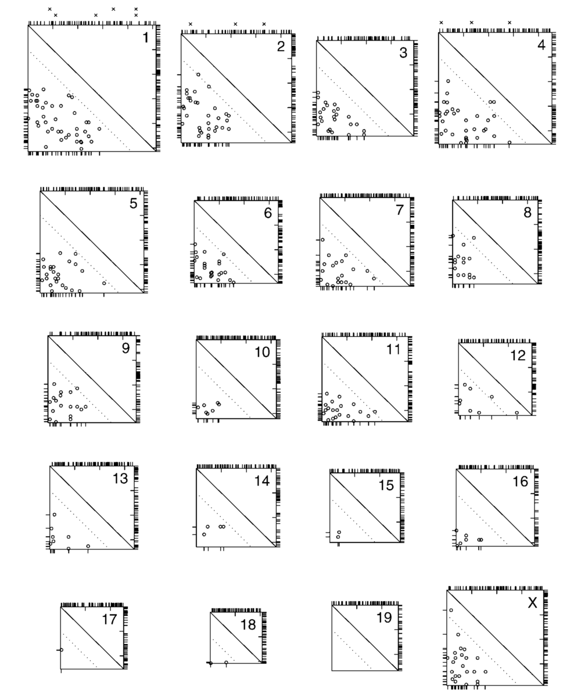

  

      <ul class="nav">
          <li><a href="xchr_fig2.html">prev</a></li>
          <li><a href="geneticmaps_fig3.html">next</a></li>
      </ul>
  

Broman KW, Rowe LB, Churchill GA, Paigen K (2002) Crossover
interference in the mouse.  [Genetics](https://academic.oup.com/genetics) 160:1123-1131

**Figure 3**. &mdash; Crossover locations for all chromosomes.  Each square
represents a chromosome, with the centromere at the top and left and
the telomere at the bottom and right. Ticks on the right indicate the
locations of the genetic markers.  The circles indicate the locations
of the pair of crossovers on meiotic products exhibiting exactly two
crossovers, with the location of the proximal and distal crossovers
shown below and to the left, respectively. Circles above the dotted
diagnonal line are crossovers separated by < 20 cM. The locations of
crossovers on meiotic products that exhibit exactly one crossover are
shown at the top. The x's above chromosomes 1, 2, and 4 indicate the
locations of crossovers on triplecrossover meiotic products.
